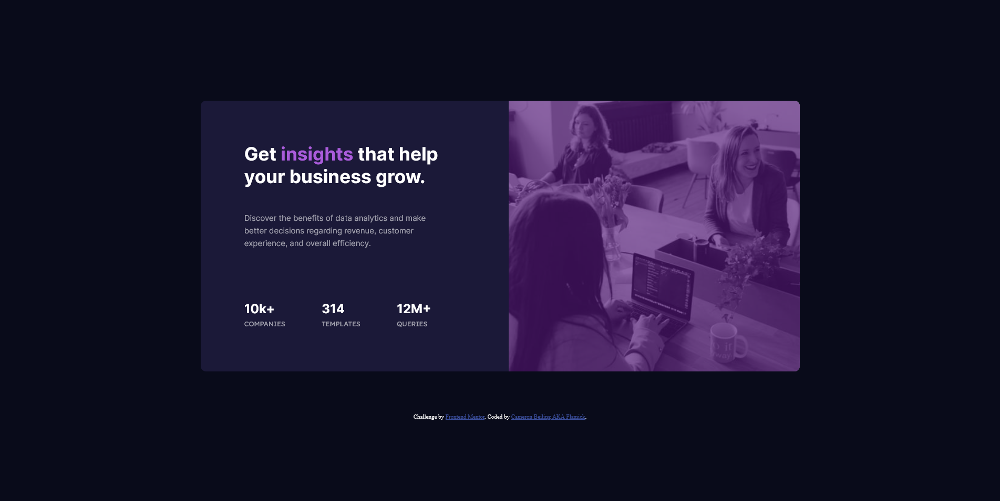
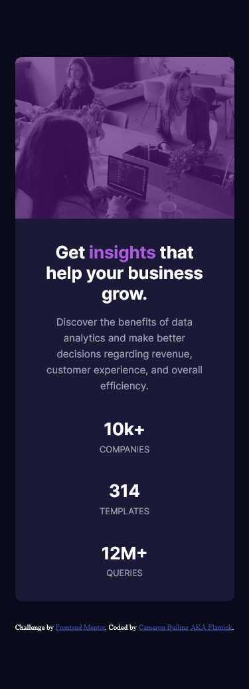

This is my solution to the [Stats preview card component challenge on Frontend Mentor](https://www.frontendmentor.io/challenges/stats-preview-card-component-8JqbgoU62). Frontend Mentor challenges help you improve your coding skills by building realistic projects. 

I struggled a bit with the responsive design of this challenge. I've been focusing on doing a mobile first design and I primarily had issues with the responsiveness of the images. I kind of had to "hack" a solution together but I know it could have been done better with proper structure to the html. Any feedback in this regard would be appreciated as that was what gave me the most issues in this challenge. Overall I feel like I ended up with a decent design overall but it could have been better. Thank you.

- Solution URL: [Frontend Mentor Solution](https://www.frontendmentor.io/solutions/html5-and-css-with-sass-to-compile-the-css-7AzncOvEz)
- Live Site URL: [Live Website](https://affectionate-visvesvaraya-88559e.netlify.app/)

-  Mentor - [@Flamick](https://www.frontendmentor.io/profile/flamick)